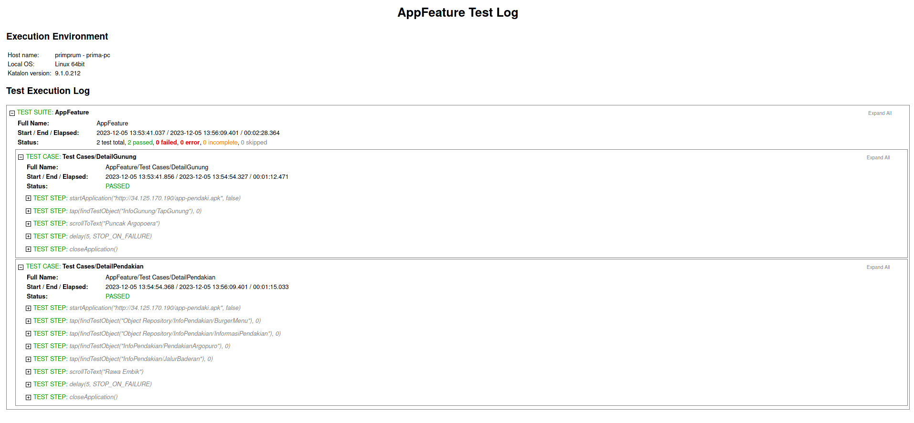

# Test Cases on 'Pendakian' App

## BDD Gherkin

```gherkin
Feature: Detail Gunung

  Scenario: User check detail on specific Gunung
    Given user is on the home screen
    When user taps the specific Gunung button
    Then user should be redirected to the Detail Gunung page

    When user scroll down on Detail Gunung page
    Then details of Gunung should be displayed until the bottom of the page
```

```gherkin
Feature: Info Pendakian

  Scenario: User check info pendakian on specific Gunung
    Given user is on the home screen
    When user taps the burger menu button and Informasi Pendakian button
    Then user should be shown the Pendakian page

    When user taps on specific Pendakian button
    Then list of Jalur Pendakian should be displayed

    When user taps on specific Jalur Pendakian button
    Then details of Jalur Pendakian should be displayed

    When user scroll down on details of Jalur Pendakian
    Then details of Jalur Pendakian should be displayed until the bottom of the page
```

## Test Result



## [Remote Device] Test Demo

[](https://www.youtube.com/embed/7NujAfctBWc)
