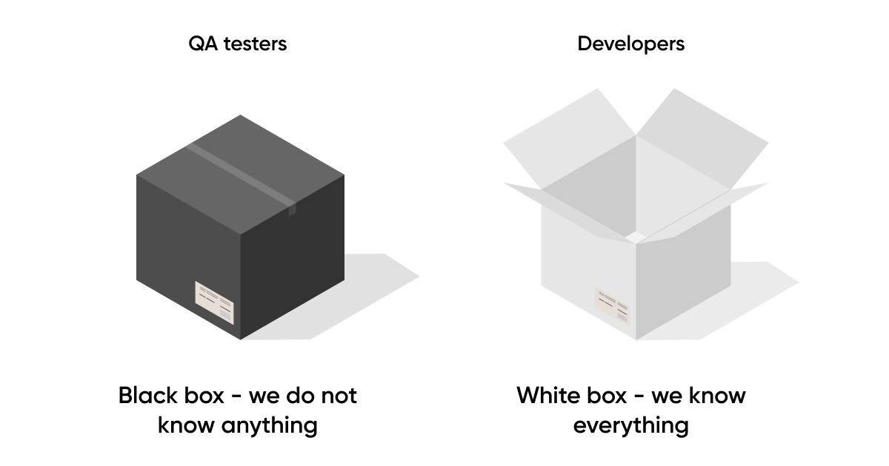

# Black Box vs White Box

Black Box Testing is a testing technique where the tester does not have knowledge of the internal workings, code, or implementation details of the software.

White Box Testing is a testing technique where the tester has knowledge of the internal workings, code, and implementation details of the software.

 

## Black Box Testing:

Validating the functionality of the software by providing inputs and examining the outputs without knowing how the system achieves the results.

**_[Example]_** 

> Clicking the login button and verifying that the user is successfully logged in without knowing the internal logic or code responsible for the authentication process.

Testers approach the software as a "black box" where they are concerned only with the inputs, outputs, and observable behaviors.

 

## White Box Testing:

Validating the internal logic, code structure, and the way different components interact with each other.

**_[Example]_** 

> Ensuring that a calculator program only accepts integer inputs by examining the code and understanding how the program processes input values.

Testers approach the software as a "white box" where they have visibility into the internal structures, algorithms, and code execution flow.

 

## [In Summary]

**_Black Box Testing_**  Test cases are designed based on specifications and requirements.

**_White Box Testing_**  Test cases are designed based on an understanding of the internal code and structures.

> Black Box and White Box Testing are valuable and are often used complementarily in a comprehensive testing strategy.
>
> Black Box Testing is useful for **_validating the software from a user's perspective_**, while White Box Testing is valuable for **_assessing internal logic and ensuring thorough coverage of the code._**

 

