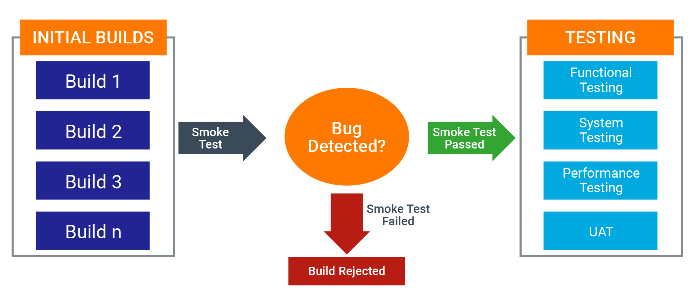
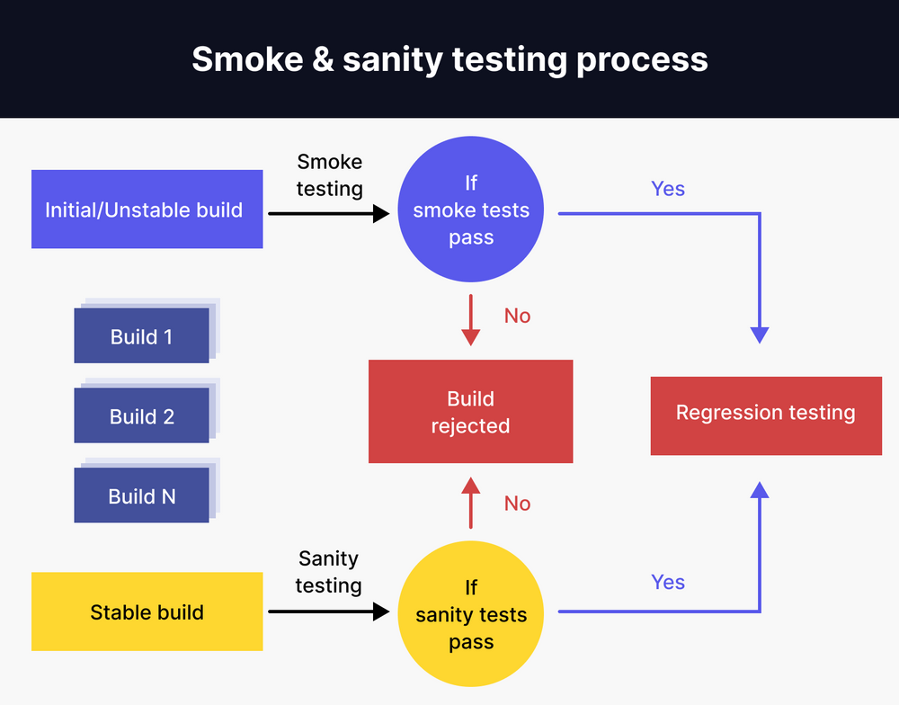
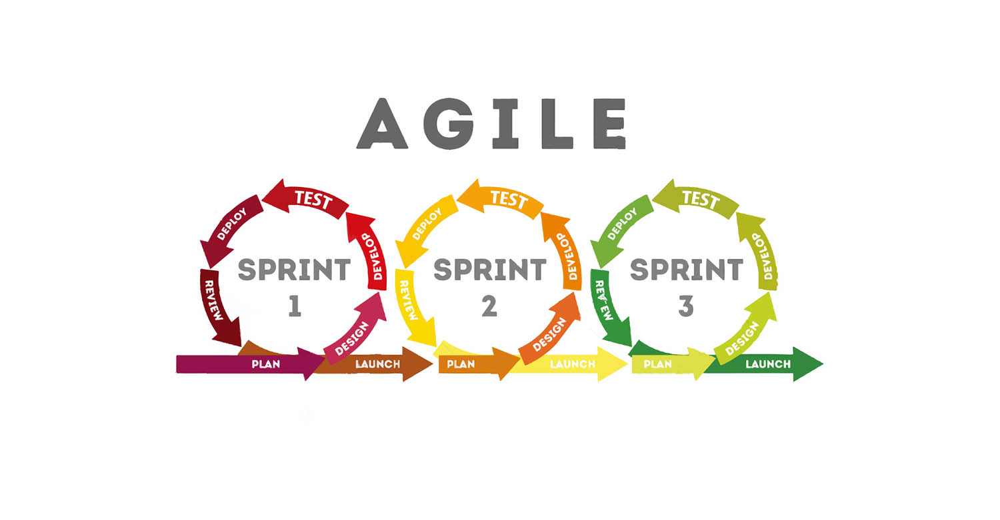
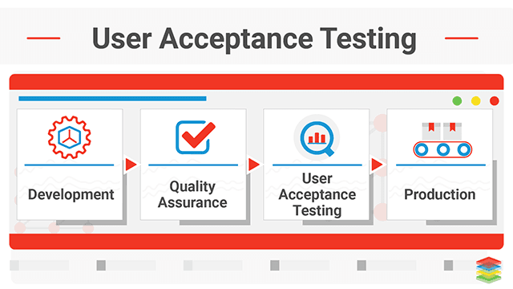

## Different Types of Functional Testing

Trying to explain in simple terms regarding different types of testing, in this case the functional testing.

 

### Functional Testing

Functional testing is a category of test where the main purpose is verifying that the functionality or feature from the software requirements works.

For example, let's say for an email website, the required functionality are:

- Create Account (steps: open website => click create account => fill username => and so on)
- Compose Email
- Email Editor
- Send Email

Making sure the required functionality and it's step passed the test is the task of functional testing.

Functional testing doesn't deal with worrying how long does it take to process the i.e. Create Account feature (as in non-functional testing)

 

### Functional Testing examples:

#### SIT (System Integration Testing)

SIT specifically focuses on testing the interactions between different components or systems in an integrated environment. It ensures that the integrated components work together as expected to deliver the required functionality.

During SIT, various subsystems or components are integrated and tested as a group to verify that they interact correctly and provide the intended functionality. This type of testing checks the interfaces between different modules, ensuring that data is passed correctly, and the integrated components work seamlessly as a whole.

System Integration Testing example => [Understanding System Integration Testing](https://github.com/primprum/eduwork-git/tree/master/System%20Integration%20Testing)

 

#### Smoke Testing

Usually smoke testing happen during initial builds where builds are still relatively unstable, but it's not exclusive to the early stages of development, it can also be performed at different phases whenever a new build is available.

It is a relatively shallow kind of test, just for the sake of ensuring the builds and main functionality (e.g. login, register, cart, checkout) to workout just fine. It focuses on the critical functionalities of the software. These functionalities are often referred to as the "core" or "basic" features.

The purpose is that if those main functionalities doesn't work, there's no point in continuing into more detailed testing.

In summary, smoke testing acts as a gatekeeper to prevent the waste of resources on more detailed testing if the basic functionalities are not working

 

#### Sanity Testing

This kind of test starts when the builds are more stable, after fixing some defects, or after adding some new functionality.

Usually it happens after build 1, maybe 2, 3, 4, and so on when we started to found out some defects caused by new changes.

For example, if Login feature just being fixed from the defects, then we need to test that Login feature to make sure that it passed the test.

It's not a full test like regression testing, it's a pre-requisite before starting the regression testing.

 

#### Regression Testing (in Agile)

Once the software undergoes changes, fixes, or enhancements, regression testing is conducted. This ensures that the recent modifications haven't adversely affected existing functionalities. Regression testing may be iterative and continuous throughout the development process.

#### UAT (User Acceptance Testing)

It is typically performed after the completion of various testing phases, including System Integration Testing (SIT), Smoke Testing, Sanity Testing, and Regression Testing. UAT is the final phase of the testing process and is carried out to ensure that the software meets the end-users' requirements and expectations.

 

#### [In Summary]

The flow of the sequence for the testing phases in a typical software development lifecycle:

**_SIT => Smoke Testing => Sanity Testing => Regression Testing => UAT_**

**System Integration Testing (SIT):**  
This phase involves testing the interactions between different modules or components in an integrated environment.

**Smoke Testing:**  
Conducted to quickly assess whether the software build is stable enough for more detailed testing.

**Sanity Testing:**  
Performed to ensure that specific functionalities or areas affected by recent changes are working as expected.

**Regression Testing:**  
Conducted to verify that recent changes or additions to the software have not adversely affected existing functionalities.

**User Acceptance Testing (UAT):**  
The final phase where end-users or stakeholders validate the software to ensure it meets their business requirements and expectations.

> In Agile methodologies, for example, testing activities may be iterative and conducted in parallel with development, and UAT may be performed in multiple cycles. Additionally, in some projects, regression testing might be an ongoing activity throughout the development lifecycle.
