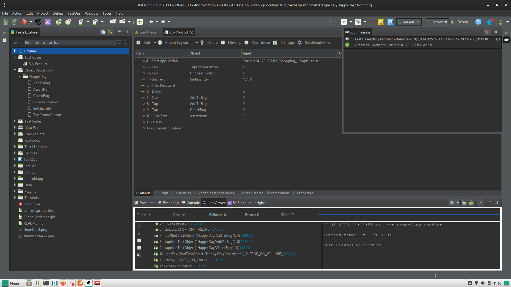

# Test Case on 'Happy Day Shopping' App

## BDD Gherkin

```gherkin
Feature: Buy Product

  Scenario: User buys a product from promotions page
    Given user is on the home screen
    When user taps the "Promo" button
    Then user should be redirected to the promotions page

    When user chooses "Danima Promo Pack Butter Cookies"
    Then details of "Danima Promo Pack Butter Cookies" should be displayed

    When user taps the "Add to Bag" button for "Danima Promo Pack Butter Cookies"
    Then bag icon should reflect the added quantity

    When user checks the bag
    Then bag should contain "Danima Promo Pack Butter Cookies" with a quantity and it's total price

    When user taps the "Checkout" button
    Then user should be directed to the checkout page
```

## Test Result



## [Remote Device] Test Demo

[](https://www.youtube.com/watch?v=NB6iWnI4emg)
