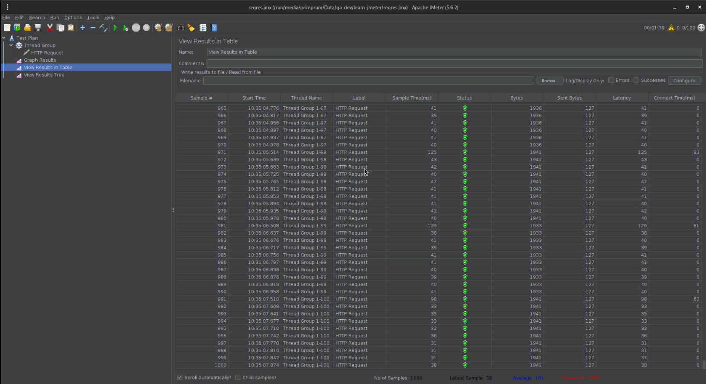
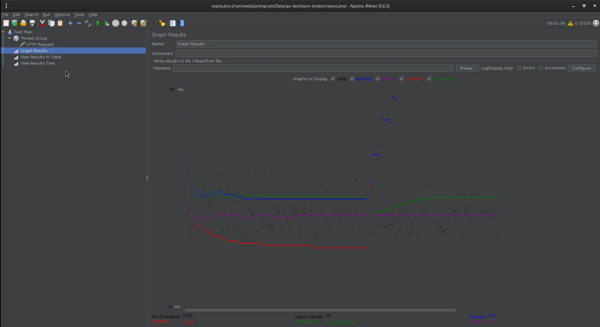
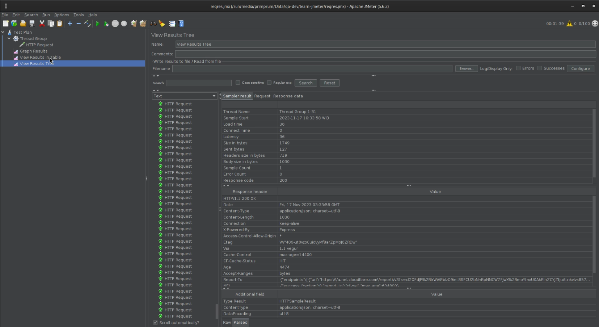

# Performance Test with JMeter

## Test Scenario:

- URL: https://reqres.in/api/users?page=2
- Number of Threads: 100
- Loop Count: 10
- Ramp-Up Period: 100

## [Recorded Action]

https://youtu.be/WWsiMULzkdw

## Test Result:

```
Number of Samples: 1000
Latest Sample: 38 ms
Average: 161 ms
Median: 40
Deviation: 1203
Throughput: 603.646/minute
```

## Explanation:

**Number of Samples: 1000**

> This indicates the total number of requests or transactions that were executed during the performance test. In this case, 1000 samples were taken.

**Latest Sample: 38 ms**

> This represents the response time of the most recent request or transaction. In this context, the latest sample had a response time of 38 milliseconds (ms).

**Average: 161 ms**

> The arithmetic mean of all the response times recorded during the test. In this case, the average response time is 161 ms, providing an overall measure of the system's responsiveness.

**Median: 40**

> The middle value of all response times when they are sorted in ascending order. In this dataset, the median response time is 40 ms. The median is often used to provide a more robust measure of central tendency, especially when dealing with skewed data.

**Deviation: 1203**

> It refers to the standard deviation of the response times. Standard deviation measures the amount of variation or dispersion in a set of values. A higher standard deviation indicates more variability in response times. In this case, a deviation of 1203 suggests a relatively high degree of variability in the response times.

**Throughput: 603.646/minute**

> Throughput represents the number of requests processed by the system per unit of time. In this case, the throughput is expressed as requests per minute, with a value of 603.646. This metric gives an indication of the system's capacity to handle a certain load. Higher throughput values generally indicate better performance.

## Graphics:

### [Table View Result]



### [Graph View Result]



### [Tree View Result]


