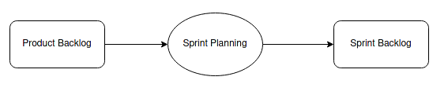

# Product Backlog and Sprint Backlog

Both serve different purposes and are associated with different timeframes.

 

Let's explore the differences between the Product Backlog and Sprint Backlog:

### Product Backlog:

A dynamic and prioritized list of all the features, enhancements, bug fixes, and other work that needs to be done on a product.

#### Ownership:

It is **owned and managed by the Product Owner**, who is responsible for prioritizing the items based on their value, business needs, and feedback from stakeholders.

#### Content:

It contains high-level items, often described as user stories, epics, or features.

> Each item in the Product Backlog represents a potential increment of value that could be delivered in future iterations.

#### Dynamic:

It is dynamic and evolves over time.

New items can be added, existing items can be reprioritized, and items can be refined as more information becomes available.

#### Prioritization:

Items at the top of the Product Backlog are considered more important, and the team is expected to work on them sooner.

The prioritization is **based on business value, strategic goals, and user feedback**.

#### [Summary]

> It provides a long-term view of the work that needs to be done on the product, allowing for strategic planning and alignment with the overall product vision.

 

### Product Backlog Example:

**[User Story 1]** 
As a customer, I want to be able to create an account on the e-commerce website so that I can track my orders.

**[User Story 2]** 
As a customer, I want to search for products based on keywords so that I can easily find items I'm interested in.

**[User Story 3]** 
As a customer, I want to view detailed product information, including images, descriptions, and prices.

**[User Story 4]** 
As a customer, I want to add products to my shopping cart and proceed to checkout.

 

### Sprint Backlog:

A subset of the Product Backlog. It consists of the work items selected for a specific iteration, known as a Sprint.

#### Ownership:

It is **owned by the Development Team**.

During the Sprint Planning meeting, the team selects the items from the Product Backlog that they commit to completing during the upcoming Sprint.

#### Content:

It includes user stories and tasks that are detailed enough to be completed within the duration of a Sprint (usually 2-4 weeks). These items are often broken down into smaller tasks.

#### Dynamic:

It is static during the Sprint.

Once the team commits to a set of work items, they should not be changed or added to during the Sprint, maintaining focus and stability.

> The Development Team uses the Sprint Backlog as a guide for their daily work during the Sprint. It helps them monitor progress and adjust their plan as needed.

#### [Summary]

> It provides a short-term view of the work that the Development Team is committed to delivering within the current Sprint.

 

### Sprint Backlog Example:

During Sprint Planning, the Scrum Team collaboratively decides which items from the Product Backlog they will work on during the upcoming Sprint.

**Workflow:**

Let's say we are in Sprint 1, and during Sprint Planning, the Development Team selects a subset of user stories from the Product Backlog to work on.

The Sprint Backlog for Sprint 1 might look like this:

**[Sprint Backlog Item 1] - Create User Registration Page:** 

**Tasks:**

- Design UI for registration page
- Implement backend logic registration
- Write tests for the registration feature

**[Sprint Backlog Item 2] - Implement Product Search Functionality:** 

**Tasks:**

- Design UI for the search bar
- Implement backend logic for search functionality
- Write tests for the search feature

 

> The Sprint Backlog, being a subset of the Product Backlog, allows the Development Team to focus on a specific set of features and tasks for the duration of the Sprint, providing a more detailed plan for their work.

 

### Conclusion

Product Backlog is a dynamic and long-term list of all potential work on the product, managed by the Product Owner.

The Sprint Backlog is a subset of the Product Backlog selected for a specific Sprint, owned by the Development Team, and provides a short-term focus for the team's work during that Sprint.
