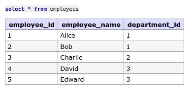
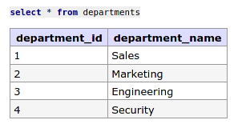
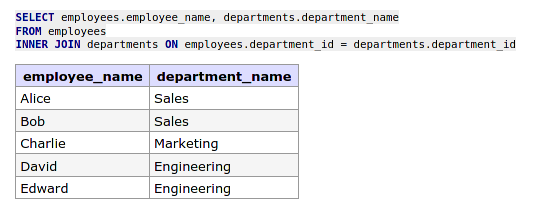
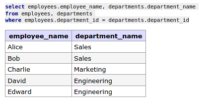
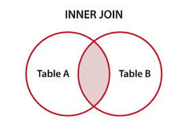

# Understanding SQL Inner Join

#### [The result of an inner join includes only the rows that have matching values in the specified columns from both tables.]

Let's say we create table `employees` and `departments`:

```sql
CREATE TABLE employees (
    employee_id INT,
    employee_name VARCHAR(50),
    department_id INT
);

CREATE TABLE departments (
    department_id INT,
    department_name VARCHAR(50)
);
```

And then we insert data to both tables:

```sql
INSERT INTO employees (employee_id, employee_name, department_id)
VALUES
    (1, 'Alice', 1),
    (2, 'Bob', 1),
    (3, 'Charlie', 2),
    (4, 'David', 3),
    (5, 'Edward', 3),

INSERT INTO departments (department_id, department_name)
VALUES
    (1, 'Sales'),
    (2, 'Marketing'),
    (3, 'Engineering'),
    (4, 'Security');
```

So, both tables with look like this:

`employees` table:



`departments` table:



Let's say we want to show `employee_name` and `department_name`, but both are from different table, and on `employees` table, there's only `department_id`, not `department_name`

By using inner join, we could do:

```sql
SELECT employees.employee_name, departments.department_name
FROM employees
INNER JOIN departments ON employees.department_id = departments.department_id;
```

And the result will be like this:



#### _[In summary, it will includes only the rows that have matching values in the specified columns from both tables.]_

So, `department_id = 4` and `department_name = 'Security'` from `departments` table will not going to be included.

## Another method (without using inner JOIN)

Using traditional method, it could also work this way:

```sql
select employees.employee_name, departments.department_name
from employees, departments
where employees.department_id = departments.department_id;
```

The result will be the same:



> The choice between using the explicit JOIN syntax and the traditional implicit join using the WHERE clause for joining tables in SQL often depends on readability, ease of understanding, and personal preference. However, the JOIN syntax is generally considered more modern, clearer, and easier to maintain

## Inner JOIN concept in diagram


