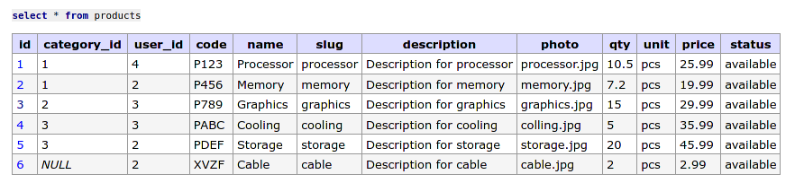
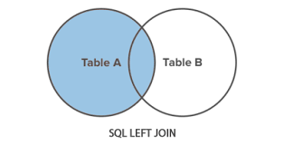

# Understanding SQL Left Join

#### [Left join returns all the rows from the left table, even if there are no corresponding matches in the right table.]

Let's say we create table `users`, `products` and `categories`:

```sql
CREATE TABLE `users` (
  `id` int(11) NOT NULL AUTO_INCREMENT,
  `email` varchar(255) DEFAULT NULL,
  `name` varchar(255) NOT NULL,
  `password` varchar(255) NOT NULL,
  `address` varchar(255) DEFAULT NULL,
  `role` varchar(255) DEFAULT NULL,
  `status` varchar(255) DEFAULT NULL,
  `created_at` timestamp NOT NULL,
  `updated_at` timestamp NOT NULL,
  PRIMARY KEY (`id`)
)

CREATE TABLE `products` (
  `id` int(11) NOT NULL AUTO_INCREMENT,
  `category_id` int(11) DEFAULT NULL,
  `user_id` int(11) DEFAULT NULL,
  `code` varchar(255) DEFAULT NULL,
  `name` varchar(255) DEFAULT NULL,
  `slug` varchar(255) DEFAULT NULL,
  `description` longtext DEFAULT NULL,
  `photo` varchar(255) DEFAULT NULL,
  `qty` double DEFAULT NULL,
  `unit` varchar(255) DEFAULT NULL,
  `price` double DEFAULT NULL,
  `status` varchar(255) DEFAULT NULL,
  PRIMARY KEY (`id`)
)

CREATE TABLE `categories` (
  `id` int(11) NOT NULL AUTO_INCREMENT,
  `code` varchar(255) DEFAULT NULL,
  `name` varchar(255) DEFAULT NULL,
  `slug` varchar(255) DEFAULT NULL,
  `description` text DEFAULT NULL,
  `status` varchar(255) DEFAULT NULL,
  `photo` varchar(255) DEFAULT NULL,
  PRIMARY KEY (`id`)
)
```

And then we insert sample data to all tables:

```sql
INSERT INTO `users` (`id`, `email`, `name`, `password`, `address`, `role`, `status`, `created_at`, `updated_at`) VALUES
(1,	'alice@example.com', 'Alice', 'pass123', '123 Main St', 'admin', 'active', NOW(), NOW()),
(2,	'bob@example.com', 'Bob', 'pass456', '456 Elm St', 'user', 'active', NOW(),	NOW()),
(3,	'charlie@example.com', 'Charlie', 'pass789', '789 Oak St', 'user', 'active', NOW(),	NOW()),
(4,	'diana@example.com', 'Diana', 'passabc', '321 Pine St', 'user', 'active', NOW(), NOW()),
(5,	'eva@example.com', 'Eva', 'passdef', '654 Cedar St', 'user', 'active', NOW(), NOW());

INSERT INTO `products` (`id`, `category_id`, `user_id`, `code`, `name`, `slug`, `description`, `photo`, `qty`, `unit`, `price`, `status`) VALUES
(1,	1,	4,	'P123',	'Processor',	'processor',	'Description for processor',	'processor.jpg',	10.5,	'pcs',	25.99,	'available'),
(2,	1,	2,	'P456',	'Memory',	'memory',	'Description for memory',	'memory.jpg',	7.2,	'pcs',	19.99,	'available'),
(3,	2,	3,	'P789',	'Graphics',	'graphics',	'Description for graphics',	'graphics.jpg',	15,	'pcs',	29.99,	'available'),
(4,	3,	3,	'PABC',	'Cooling',	'cooling',	'Description for cooling',	'colling.jpg',	5,	'pcs',	35.99,	'available'),
(5,	3,	2,	'PDEF',	'Storage',	'storage',	'Description for storage',	'storage.jpg',	20,	'pcs',	45.99,	'available'),
(6,	NULL,	2,	'XVZF',	'Cable',	'cable',	'Description for cable',	'cable.jpg',	2,	'pcs',	2.99,	'available');

INSERT INTO `categories` (`id`, `code`, `name`, `slug`, `description`, `status`, `photo`) VALUES
(1,	'C123',	'Performance',	'performance',	'Performance Description',	'available',	'performance.jpg'),
(2,	'C456',	'Gaming',	'gaming',	'Gaming 2 Description',	'available',	'gaming.jpg'),
(3,	'C789',	'Accessories',	'accessories',	'Accessories Description',	'available',	'accessories.jpg');
```

So, all tables with look like this:

`users` table:


`products` table:



`categories` table:


### Solving the case

In `products` table, there is no category name, only the category_id which refers into field id in `categories` table

Let's say we want to show category name by using category_id from `products` table. If we use inner join, it will be like this:

```sql
select products.id, products.name, categories.name from products inner join categories on products.category_id = categories.id;
```

And the result will be:


But we know that there are 6 records in `products` table, if we want to show all the products even if that product has not been categorized yet, then we could use left join instead:

```sql
select products.id, products.name, categories.name from products left join categories on products.category_id = categories.id;
```

And the result will be:


#### _[In summary, it will returns all the rows from the left table, even if there are no corresponding matches in the right table.]_

### Left JOIN concept in diagram


