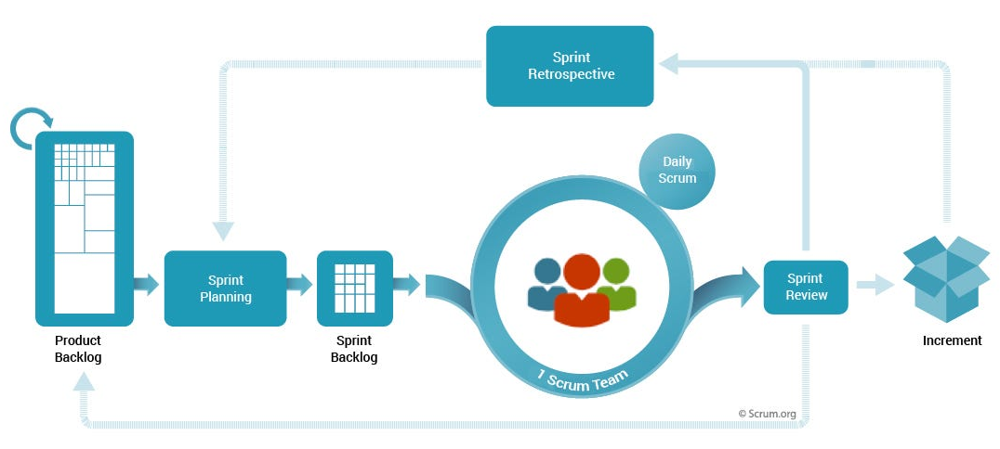

## Sprint Review vs Sprint Retrospective

While the Sprint Review and Sprint Retrospective events in Scrum both occur at the end of a Sprint and share the goal of continuous improvement, they serve different purposes and involve distinct activities.

### Sprint Review:

**_Focused on inspecting and adapting the product increment that was built during the Sprint._**

- It is an opportunity for the Scrum Team to demonstrate the completed work to stakeholders, including the Product Owner, customers, end-users, executives, and other relevant parties.

> The focus is on showcasing what was done, obtaining feedback, and collaboratively discussing any adjustments to the Product Backlog based on that feedback.

#### Activities:

- Demonstration of the completed product increment.
- Discussion of what was done and what wasn't done.
- Feedback and input from stakeholders.
- Collaborative decision-making regarding the next steps, including potential adjustments to the Product Backlog.

 

### Sprint Retrospective:

**_Focused on inspecting and adapting the process and ways of working during the Sprint._**

- It provides the Scrum Team with a dedicated time to reflect on the Sprint, identify what went well, and discuss opportunities for improvement.

> The goal is to enhance team collaboration, identify and address impediments, and find ways to make the next Sprint more effective and enjoyable.

#### Activities:

- Reflection on what went well during the Sprint.
- Identification of areas for improvement or challenges faced.
- Open discussion about potential solutions or changes to improve team performance.
- Agreement on specific actions or experiments to be undertaken in the next Sprint for continuous improvement.

 

### What's the Differences?

#### [Objectives]

**Sprint Review:**  Focused on the product and obtaining feedback from stakeholders.

**Sprint Retrospective:**  Focused on the process and ways of working within the Scrum Team.

#### [Participants]

**Sprint Review:**  Scrum Team and stakeholders.

**Sprint Retrospective:**  Only the Scrum Team (PO, SM, DT)

#### [Activities]

**Sprint Review:**  Product demonstration and collaborative decision-making regarding the product increment.

**Sprint Retrospective:**  Involves reflection, identification of improvement areas, and discussion of solutions for process enhancement.

 

### Summary

> Both events contribute to continuous improvement, the **_Sprint Review is about the product_**, while the **_Sprint Retrospective is about the process_** and teamwork.
>
> They complement each other to ensure both the product and the way of working are continually refined and improved.

 

### Give me example?

Let's consider an example project involving the **_development of a web-based project management tool_** using the Scrum framework.

We'll explore what might happen during the Sprint Review and Sprint Retrospective for a specific Sprint.

#### [Project Overview]

#### Product Backlog Items:

**User Story 1:**  As a project manager, I want to be able to create and assign tasks to team members.

**User Story 2:**  As a team member, I want to receive notifications when a task is assigned to me.

**User Story 3:**  As a user, I want to view a dashboard that shows the progress of ongoing projects.

 

#### [The Activities] - Sprint Review (End of Sprint 1):

**Product Increment:** 
The development team has completed the features related to creating and assigning tasks, implementing notifications, and displaying project progress on the dashboard.

**Demonstration:** 
The team demonstrates the new features, showcasing the task creation and assignment workflow, notification system, and the interactive dashboard.

**Feedback from Stakeholders:** 
Stakeholders provide feedback on the implemented features.
The Product Owner discusses potential adjustments to the Product Backlog based on feedback.

**Decisions:** 

> The team and stakeholders collaboratively decide that the **_notification system needs further refinement, and additional data points should be included on the dashboard_**.

 

#### [The Activities] - Sprint Retrospective (Immediately following Sprint Review):

**Reflection:** 

- The team reflects on what went well during Sprint 1, such as successful implementation of task creation and assignment features.
- The team discusses areas for improvement, such as **_the need for more thorough testing of the notification system_** before the next Sprint.

**Challenges Identified:** 
The team acknowledges challenges faced, such as some communication gaps between team members during the implementation of the notification feature.

**Discussion of Solutions:** 
The team discusses potential solutions, such as implementing a more structured communication plan during feature implementation and allocating more time for testing.

**Action Items:** 
The team agrees on specific action items for the next Sprint:

- Allocating time for testing
- Enhancing communication during feature implementation
- Refining the notification system based on feedback.

 

#### [Next Steps] - For the next iteration

**Sprint Planning for Sprint 2:** 

- The team incorporates the lessons learned from the Sprint Retrospective into the planning for Sprint 2.

> Adjustments to the Product Backlog are made based on decisions made during the Sprint Review.

**Development in Sprint 2:** 
The team begins work on the next set of prioritized Product Backlog items for Sprint 2, incorporating improvements identified during the Sprint Retrospective.

 

### Conclusion

This example illustrates how the **_Sprint Review focuses on the product, obtaining feedback, and making decisions about the Product Backlog_**, while the **_Sprint Retrospective focuses on the team's process, identifying challenges, discussing solutions, and planning actions for continuous improvement_** in the upcoming Sprint.

The insights gained from the Retrospective contribute to a more effective and collaborative team dynamic over successive Sprints.

 

### [Scrum Diagram]

