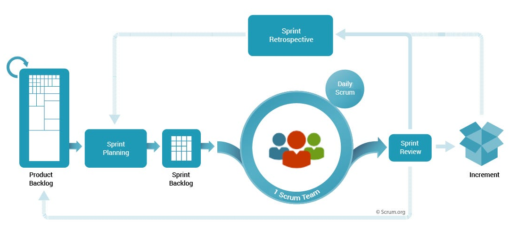

# Scrum Workflow

During Sprint Planning, the Scrum Team collaboratively decides which items from the Product Backlog they will work on during the upcoming Sprint.

The selected items are then detailed and broken down into tasks, forming the Sprint Backlog.

 

Here's a step-by-step overview of the process:

### Sprint Planning:

- The Product Owner and the Development Team come together for the Sprint Planning event.
- The Product Owner presents the highest-priority items from the Product Backlog.
- The Development Team and the Product Owner discuss the items, clarify details, and agree on what can be accomplished in the upcoming Sprint.
- The Development Team selects a subset of items to bring into the Sprint Backlog for the current Sprint.

 

### Sprint Backlog:

- The items selected for the Sprint are now part of the Sprint Backlog.
- The Development Team further decomposes the selected items into tasks, subtasks, or technical activities necessary to implement the features.
- The Sprint Backlog represents the plan for the work to be done during the Sprint and is owned by the Development Team.

 

### During the Sprint:

- The Development Team collaboratively works on completing the tasks outlined in the Sprint Backlog.

> Daily Scrum meetings are conducted to discuss progress, share updates, and identify any impediments or blockers.

 

### Sprint Review:

- The Product Owner may provide feedback, and stakeholders may have the opportunity to ask questions.

> At the end of each Sprint (every 2-4 weeks), the Scrum Team conducts a Sprint Review where they demonstrate the completed work to stakeholders.

 

### Sprint Retrospective:

Following the Sprint Review, the Scrum Team holds a Sprint Retrospective to reflect on the Sprint, discuss what went well and what could be improved, and identify action items for continuous improvement.

 

### [Workflow in Diagram]

 
