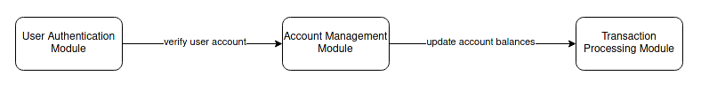

## Understanding SIT (System Integration Testing)

In here, I'm trying to give an example of the implementation of SIT on the context of an online banking system.

 

### Scenario: Online Banking System

#### Modules:

- **User Authentication Module**:  
  Responsible for user login and authentication.
- **Account Management Module**:  
  Handles tasks related to user accounts, such as creating new accounts, updating account information, and closing accounts.
- **Transaction Processing Module**:  
  Manages financial transactions, including deposits, withdrawals, and transfers.

#### Integration Points:

The User Authentication Module interacts with the Account Management Module to verify user account details during login.

The Transaction Processing Module interacts with the Account Management Module to update account balances after transactions.

 

### System Integration Testing Scenarios:

#### Scenario 1: Login and Account Information Retrieval

#### Test Steps:

- Enter valid credentials and check if the user can successfully log in.

- Verify that user account details are retrieved correctly from the Account Management Module.

#### Scenario 2: Funds Transfer Transaction

#### Test Steps:

- Initiate a funds transfer transaction and confirm that the Transaction Processing Module deducts the correct amount from the sender's account.

- Verify that the Transaction Processing Module updates the recipient's account with the transferred amount.

 

### Test Cases:

Test cases would be designed to cover various integration points, ensuring that data is correctly passed between modules and that the integrated components work together seamlessly.

### Validation:

Validate that the integrated system behaves as expected, and the modules collaborate correctly to provide the desired functionality.

### Issues Identified:

Issues might include incorrect data transfer between modules, authentication failures, or discrepancies in account balances after transactions.

### Conclusion:

> In summary, SIT ensures that the integrated banking system functions correctly by testing the interactions between modules responsible for authentication, account management, and transaction processing. The goal is to validate that the system as a whole meets the specified requirements when different components work together.

 

### [Comparing SIT and Smoke Testing]

While both SIT and Smoke Testing are preliminary tests conducted early in the testing process, SIT specifically focuses on integration aspects and interactions between components, whereas Smoke Testing is a more general test to assess the overall stability of the software build.
