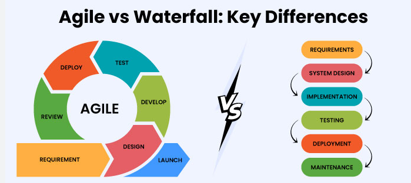

## Waterfall Method vs Agile Method

Before trying to understand between both method, let's dive into common phases in SDLC (Software Development Life Cycle).

The flow are usually the following:

1. **Requirement Analysis**
2. **Planning**
3. **Design**
4. **Implementation (Coding)**
5. **Testing**
6. **Deployment (Release)**
7. **Maintenance and Support**

 

### Requirement Analysis

Gathering and analyzing requirements from stakeholders to define the system's functionality, features, and constraints.

### Planning

Creating a project plan that includes timelines, resource allocation, budgeting, and overall strategy for the development process.

### Design

Creating a detailed system design based on the requirements, specifying how the software will meet the identified needs.

This phase includes both high-level architectural design and detailed low-level design.

### Implementation (Coding)

Translating the design into code. Developers write, compile, and integrate code modules to build the complete software application.

### Testing

Verifying that the developed software meets the specified requirements. Testing involves identifying and fixing defects to ensure the software's quality.

### Deployment (Release)

Releasing the software for production use after it has been thoroughly tested and validated. Deployment may involve installation, configuration, and migration of data.

### Maintenance and Support

Addressing issues that arise after the software is deployed. Maintenance may include bug fixes, updates, enhancements, and ongoing support.

 

Now, let's compare between 2 methods:

### _[On Waterfall Context]_

#### Sequential Process:

In the Waterfall model, the software development life cycle progresses through distinct phases in a linear and sequential fashion.

Each phase must be completed before moving on to the next.

#### Requirements Gathering:

All requirements are gathered and documented at the beginning of the project, forming a comprehensive and detailed specification.

#### Big-Bang Delivery:

The development team works on the entire project in one go, and the final product is delivered to the customer after all phases (such as design, development, testing) are completed.

#### Late Feedback:

Stakeholders often see the product only at the end of the development cycle, which means that any feedback or changes are addressed late in the process.

#### Rigid and Predictable:

The Waterfall model is more rigid and less adaptable to changes once the project has started. Changes are costly and time-consuming.

 

### _[On Agile Context]_

#### Iterative and Incremental:

Agile divides the project into small increments called iterations or sprints.

Each iteration represents a portion of the features and functionalities that can be developed, tested, and delivered.

#### Continuous Feedback:

Regular feedback is sought from stakeholders during and after each iteration, allowing for flexibility in adapting to changing requirements and priorities.

#### Customer Collaboration:

Collaboration with customers and stakeholders is emphasized throughout the development process, ensuring that the delivered product aligns closely with user needs.

#### Adaptive to Change:

Agile is designed to be adaptive and responsive to changing requirements.

Changes can be implemented easily at any stage of the project.

#### Early and Regular Delivery:

Deliveries are made in small, functional increments, allowing stakeholders to see and use parts of the product early on.

This helps in managing expectations and incorporating feedback.

#### Cross-Functional Teams:

Agile encourages the formation of cross-functional teams, where members from different disciplines (development, testing, business analysis) work collaboratively.

 
 

#### [Agile vs Waterfall]

 

#### [Fast Deliveries in Agile]

 
 

### [Summary]

> Waterfall follows a linear and sequential approach, while Agile is iterative, incremental, and flexible. Agile allows for more frequent collaboration, early and regular deliveries, and the ability to adapt to changing requirements
